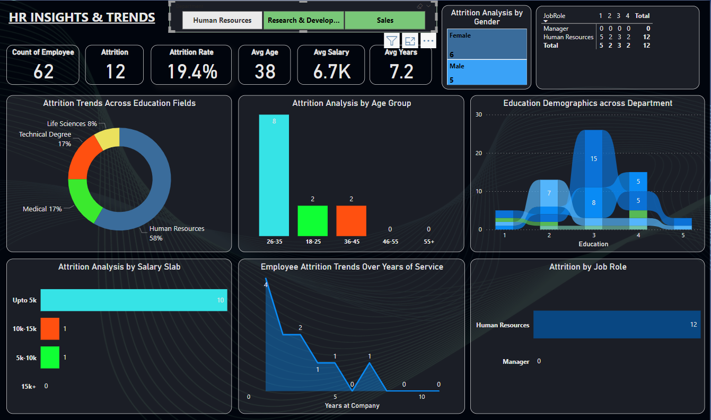

<h1 align="center" id="title">HR Workforce Analysis</h1>

<p align="center"></p>

<p id="description">This project focuses on analyzing employee data to uncover actionable insights that help organizations optimize workforce planning talent management and HR decision-making. By leveraging data analytics and visualization tools the project aims to identify patterns in employee demographics attrition performance hiring trends and satisfaction levels. Through exploratory data analysis (EDA) KPIs and interactive dashboards the project provides a clear view of HR metrics such as employee turnover rate department-wise distribution experience levels and promotion timelines—helping HR professionals make strategic data-driven decisions to enhance productivity and employee retention.</p>

<h2>🚀 Demo</h2>

[https://lookerstudio.google.com/s/nkqN94ja7i0](https://lookerstudio.google.com/s/nkqN94ja7i0)

<h2>Project Screenshots:</h2>





  
  
<h2>🧐 Features</h2>

Here're some of the project's best features:

*   📌 Data Cleaning & Preprocessing
*   📊 Exploratory Data Analysis (EDA)
*   📉 Risk Factor Analysis
*   📁 Segmentation of Applicants
*   📈 Interactive Visualizations
*   🔍 Insights Summary
*   📊 Dashboard (Optional/Planned)

<h2>🛠️ Installation Steps:</h2>

<p>1. Clone the Repository Begin by cloning the repository to your local machine: bash Copy Edit</p>

```
gh repo clone khanfaisal79960/HR-Workforce-Analysis cd HR-Workforce-Analysis
```

<p>2. Download Power BI (if not installed)</p>

<p>3. Open bank_loan_data_insights.pbix in power bi</p>

  
  
<h2>💻 Built with</h2>

Technologies used in the project:

*   Power BI
*   Google Data Studio / Looker Studio
*   Advanced Excel
*   DAX
