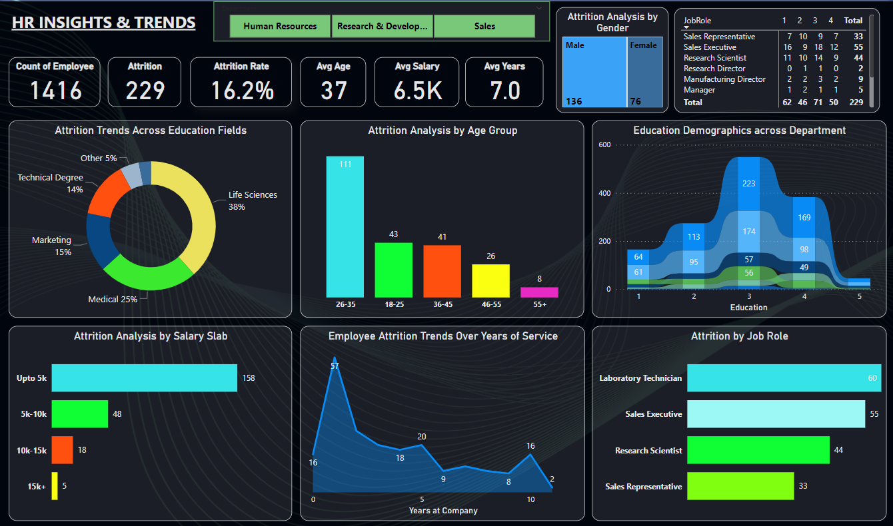
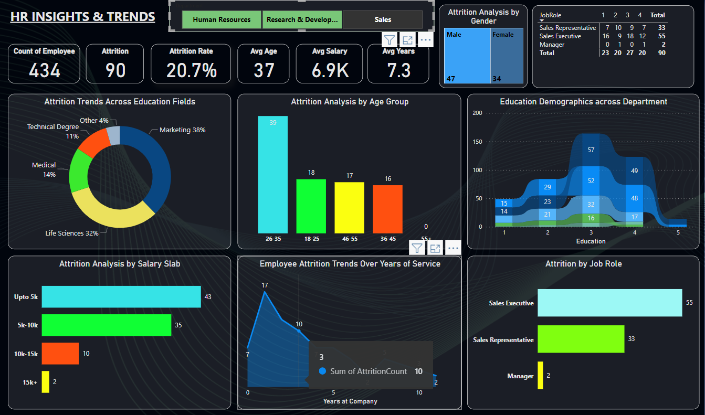

<h1 align="center" id="title">📊 HR Workforce Analysis</h1>

  

  A comprehensive project designed to analyze workforce data and uncover actionable HR insights. The objective is to empower organizations with data-driven strategies for workforce planning, talent management, and improved HR decision-making. Utilizing data analytics and visualization tools, this project explores trends in employee demographics, attrition, hiring, performance, satisfaction levels, and more. Through Exploratory Data Analysis (EDA), KPIs, and interactive dashboards, HR professionals gain clarity on crucial metrics like turnover rates, departmental distributions, experience levels, and promotion cycles.

<h2>🚀 Live Demo</h2>

  🔗 <a href="https://lookerstudio.google.com/s/nkqN94ja7i0" target="_blank">Click here to view the interactive dashboard in Looker Studio</a>

<h2>📸 Project Screenshots</h2>

  

  

<h2>🧐 Features</h2>

<ul>
  <li>✅ <strong>Data Cleaning & Preprocessing</strong></li>
  <li>📊 <strong>Exploratory Data Analysis (EDA)</strong></li>
  <li>🧠 <strong>Risk Factor Identification</strong></li>
  <li>🧾 <strong>Segmentation of Applicants</strong></li>
  <li>📈 <strong>Interactive Visualizations and Dashboards</strong></li>
  <li>🔍 <strong>Summary of Actionable Insights</strong></li>
  <li>📌 <strong>HR KPIs like Turnover, Promotion Trends, etc.</strong></li>
</ul>

<h2>🛠️ Installation & Usage</h2>

<ol>
  <li><strong>Clone the Repository</strong>
    <pre><code>gh repo clone khanfaisal79960/HR-Workforce-Analysis
cd HR-Workforce-Analysis</code></pre>
  </li>
  <li><strong>Install Power BI</strong> 
    Download and install <a href="https://powerbi.microsoft.com/desktop/" target="_blank">Power BI Desktop</a> if you haven't already.
  </li>
  <li><strong>Open the Report</strong> 
    Open the <code>bank_loan_data_insights.pbix</code> file using Power BI to explore the report offline.
  </li>
</ol>

<h2>💻 Built With</h2>

<ul>
  <li>📊 <strong>Power BI</strong> – for creating interactive dashboards</li>
  <li>📈 <strong>Google Data Studio (Looker Studio)</strong> – for web-based visualizations</li>
  <li>📋 <strong>Advanced Excel</strong> – for initial data preprocessing</li>
  <li>🔢 <strong>DAX</strong> – for data modeling and KPIs in Power BI</li>
</ul>

⭐️ If you like this project, consider giving it a star on GitHub!

